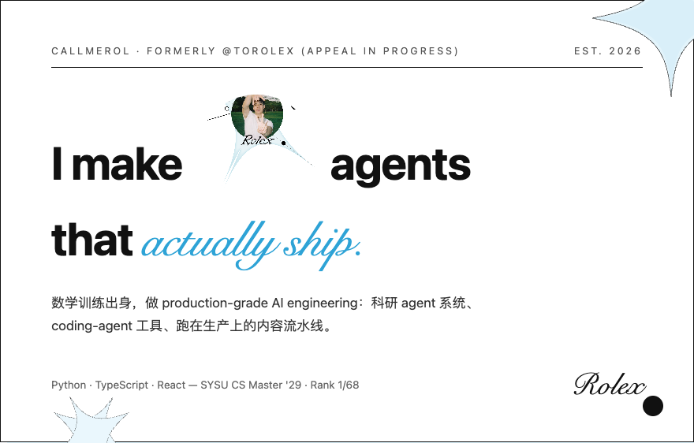

  

## Selected Work

> 原账号 **[@toRolex](https://github.com/toRolex)** 被错误封禁，申诉进行中 — 这里是我的新家，作品照常营业。

- **[ai-video-pipeline](https://github.com/toRolex/ai-video-pipeline)** — AI 驱动的短视频自动化生产系统：control-plane + runtime-worker 架构，Web 前端全流程操作，生产环境在跑
- **[Research-OS](https://github.com/toRolex/Research-OS)** — provider-neutral 科研 agent 系统：Agent Skills + typed Artifact 契约 + 确定性 CLI
- **[periscope](https://github.com/toRolex/periscope)** — 给纯文本 coding agent 的视觉桥，把图片译成文字描述（GPL-3.0）
- **[PostHub](https://github.com/toRolex/PostHub)** — 发布中枢：一个视频，一键/定时分发抖音、小红书、视频号
- **[tuxevil-rotator](https://www.npmjs.com/package/tuxevil-rotator)** — multi-provider AI proxy rotator，per-model 路由 + 实时配额追踪（npm）

## More

- **[dictionary-of-ai-coding-zh](https://github.com/toRolex/dictionary-of-ai-coding-zh)** — AI 编程词典 · **[fund-pilot](https://github.com/toRolex/fund-pilot)** · **[pasteup](https://github.com/toRolex/pasteup)** · **[live-photo](https://github.com/toRolex/live-photo)** · **[sira](https://github.com/toRolex/sira)**

## Contact

  
  
  

